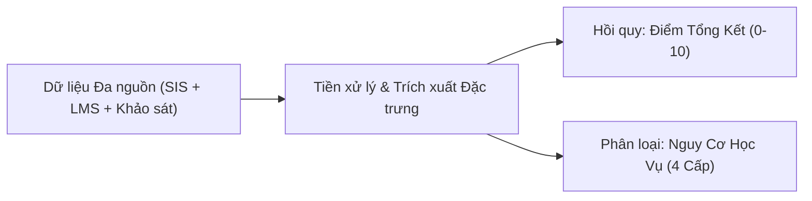
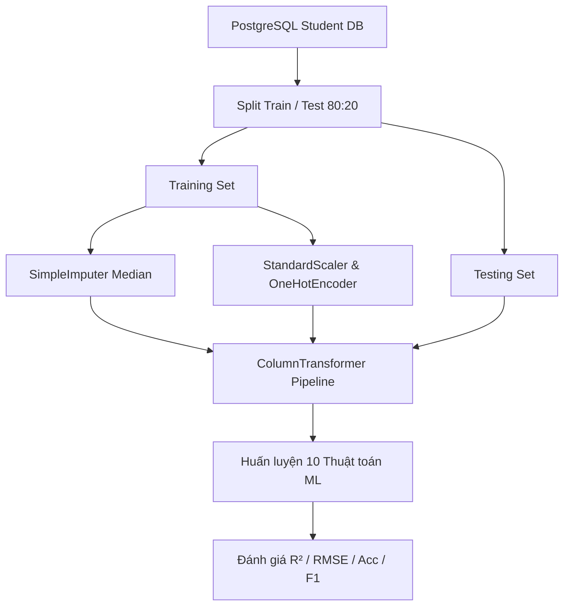

# BÁO CÁO KỊCH BẢN SLIDE THUYẾT TRÌNH CHI TIẾT (8 SLIDE)
## DỰ ÁN: HỆ THỐNG PHÂN TÍCH VÀ DỰ BÁO KẾT QUẢ HỌC TẬP SINH VIÊN (V2.0)

---

## 📌 SLIDE 1: TRANG TIÊU ĐỀ VÀ TỔNG QUAN DỰ ÁN

### 🎯 Nội dung Slide:
* **Tiêu đề dự án:** HỆ THỐNG PHÂN TÍCH VÀ DỰ BÁO KẾT QUẢ HỌC TẬP SINH VIÊN (BẢN NÂNG CẤP V2.0)
* **Phân hệ:** Ứng dụng Desktop Hỗ trợ Ra quyết định Can thiệp Học vụ (Decision Support System)
* **Đơn vị thực hiện:** Nhóm Nghiên cứu & Phát triển Đồ án Cơ sở ngành
* **Công nghệ cốt lõi:** 
  * **Ngôn ngữ & Giao diện:** Python 3.11+, PyQt6 (Dark Theme Corporate)
  * **Cơ sở dữ liệu:** PostgreSQL 18 (Containerized trên Docker)
  * **Máy học & Xử lý dữ liệu:** scikit-learn, XGBoost, pandas, numpy, matplotlib

> **Lời thoại thuyết trình (Speaker Notes):**
> *"Kính chào Thầy/Cô và các bạn. Hôm nay nhóm xin phép trình bày về dự án 'Hệ thống Phân tích và Dự báo Kết quả Học tập Sinh viên v2.0'. Đây không chỉ là một ứng dụng demo mô hình máy học thông thường, mà là một hệ thống hoàn chỉnh hỗ trợ giảng viên ra quyết định can thiệp học vụ dựa trên dữ liệu thực tế và mô phỏng giả định."*

---

## 📌 SLIDE 2: PHÁT BIỂU BÀI TOÁN VÀ THỰC TRẠNG DỮ LIỆU

### 🎯 Nội dung Slide:
* **Bối cảnh đào tạo:** Đào tạo theo hệ thống tín chỉ kết hợp quản lý học tập trực tuyến (LMS).
* **Quy mô tập dữ liệu:** 1.000 sinh viên thực tế, 18 biến đầu vào đa chiều:
  * *Nhóm SIS/Đào tạo:* Điểm THPT, Điểm Giữa Kỳ (GK), Điểm Quiz, Điểm Bài tập, Chuyên cần (%).
  * *Nhóm LMS/Hành vi:* Giờ truy cập LMS, Thời lượng xem video bài giảng, Tỷ lệ nộp bài đúng hạn (%).
  * *Nhóm Tâm lý/Khảo sát:* Mức độ Stress (1-5), Động lực học tập (1-5), Hoàn cảnh kinh tế, Đi làm thêm.
* **Mục tiêu bài toán kép (Dual-target Prediction):**
  1. **Bài toán Hồi quy (Regression):** Dự báo continuous `Điểm Tổng Kết Cuối Kỳ` ($y_{reg} \in [0.0, 10.0]$).
  2. **Bài toán Phân loại (Classification):** Phân loại ordinal `Nguy Cơ Học Vụ` ($y_{cls} \in \{\text{Rất thấp}, \text{Thấp}, \text{Trung bình}, \text{Cao}\}$).



---

## 📌 SLIDE 3: HẠN CHẾ CỦA CÁC TIẾP CẬN CŨ (MOTIVATION)

### 🎯 Nội dung Slide:
Nhóm đã tìm hiểu và chỉ ra **3 hạn chế lớn** của các bài toán dự báo học vụ hiện nay:

1. **Hạn chế 1 — Bài toán dừng lại ở "Dự báo tĩnh":** Các hệ thống cũ chỉ đưa ra kết quả điểm dự đoán mà không có công cụ giúp giảng viên trả lời câu hỏi: *"Nếu sinh viên cải thiện chỉ số X thì điểm số sẽ thay đổi như thế nào?"*
2. **Hạn chế 2 — Thiếu tính năng Mô phỏng Giả định (What-If):** Chỉ có 1-2 slider sơ sài, không có so sánh Trước/Sau song song, không có Phân tích Độ nhạy (Sensitivity Analysis), không có bộ giải ngược (Reverse What-If - *"Muốn đạt 8.0 thì cần làm gì?"*).
3. **Hạn chế 3 — Xử lý Dữ liệu khuyết thiếu cứng nhắc:** Các ứng dụng cũ tự động điền số giả lập (Median/Mode) trực tiếp vào CSDL, làm sai lệch dữ liệu gốc và không có cơ chế Cảnh báo 3 cấp độ (Critical / Warning / Info) cho giảng viên.

---

## 📌 SLIDE 4: ĐIỂM MỞ RỘNG ĐỘT PHÁ CỦA NHÓM (BẢN V2.0 UPGRADE)

### 🎯 Nội dung Slide:
Để giải quyết triệt để các hạn chế trên, nhóm đã nâng cấp 2 Module chuyên sâu:

```
┌────────────────────────────────────────────────────────────────────────┐
│                      ĐIỂM MỞ RỘNG BẢN CẬP NHẬT V2.0                     │
├───────────────────────────────────┬────────────────────────────────────┤
│ 🔮 1. WHAT-IF ENGINE V2.0         │ ⚠️ 2. CẢNH BÁO DỮ LIỆU KHUYẾT THIẾU│
├───────────────────────────────────┼────────────────────────────────────┤
│ • 7 Slider biến đòn bẩy học tập   │ • Cảnh báo 3 mức: 🔴🔴🟠🔴🟡       │
│ • Load giá trị thực từ CSDL gốc   │ • Bảo tồn CSDL PostgreSQL gốc      │
│ • So sánh Before/After & Δ màu    │ • Thanh độ tin cậy dự báo %        │
│ • Biểu đồ cột Matplotlib Realtime │ • Báo cáo Sức khỏe Dataset Health  │
│ • Phân tích độ nhạy (Sensitivity) │ • Khuyến nghị hành động sư phạm    │
│ • Reverse What-If (Solver ngược)  │ • Tuân thủ Đạo đức AI (R-ETH-01)   │
└───────────────────────────────────┴────────────────────────────────────┘
```

---

## 📌 SLIDE 5: KIẾN TRÚC THUẬT TOÁN VÀ PIPELINE TIỀN XỬ LÝ

### 🎯 Nội dung Slide:
* **Quy trình Pipeline chống rò rỉ dữ liệu (Strict R-DATA-04 Rule):**
  * Tách biệt 100% dữ liệu Train/Test (Tỷ lệ 80/20) TRƯỚC KHI fit bất kỳ bộ chuẩn hóa nào.
  * Tích hợp `SimpleImputer` (Median cho số, Most Frequent cho chữ) + `StandardScaler` + `OneHotEncoder` trong Pipeline.



---

## 📌 SLIDE 6: KẾT QUẢ HUẤN LUYỆN VÀ ĐÁNH GIÁ MÔ HÌNH (BENCHMARK)

### 🎯 Nội dung Slide:
Nhóm đã thử nghiệm và đánh giá đối chiếu **5 Thuật toán Hồi quy** và **5 Thuật toán Phân loại**:

#### 1. Bảng kết quả Hồi quy Điểm số (Continuous Grade Prediction):
| Thuật toán | Train $R^2$ | Test $R^2$ | 5-Fold CV $R^2$ | RMSE | MAE | Trạng thái |
|:---|:---:|:---:|:---:|:---:|:---:|:---:|
| **Baseline (Mean)** | 0.0000 | -0.0006 | -0.0023 | 1.3397 | 1.0730 | Không Overfit |
| **Linear Regression** | 0.9424 | **0.9408** | 0.9351 | **0.3258** | **0.2609** | **Tối ưu nhất** |
| **Ridge Regression** | 0.9423 | **0.9407** | 0.9353 | **0.3260** | **0.2611** | **Tối ưu nhất** |
| **Lasso Regression** | 0.9406 | 0.9410 | 0.9379 | 0.3253 | 0.2604 | Ổn định |
| **Random Forest** | 0.9907 | 0.9292 | 0.9307 | 0.3563 | 0.2830 | Hơi quá khớp |
| **XGBoost Regressor** | 0.9959 | 0.9258 | 0.9247 | 0.3647 | 0.2907 | Hơi quá khớp |

#### 2. Bảng kết quả Phân loại Nguy cơ Học vụ (Risk Classification):
| Thuật toán | Train Acc | Test Acc | 5-Fold CV Acc | F1-Macro | Trạng thái |
|:---|:---:|:---:|:---:|:---:|:---:|
| **Gradient Boosting** | 1.0000 | **95.00%** | **95.00%** | **0.9387** | **Chính xác nhất** |
| **Logistic Regression** | 0.9865 | **94.58%** | **95.94%** | **0.9296** | Nhanh & Nhẹ |
| **XGBoost Classifier** | 1.0000 | **94.58%** | **95.52%** | **0.9415** | Cao |

* **Công thức toán học đánh giá:**
  $$RMSE = \sqrt{\frac{1}{N} \sum_{i=1}^N (y_i - \hat{y}_i)^2} = \pm 0.32 \text{ điểm}$$

---

## 📌 SLIDE 7: MINH HỌA GIAO DIỆN PYQT6 VÀ TRẢI NGHIỆM NGƯỜI DÙNG

### 🎯 Nội dung Slide:
Hệ thống được thiết kế theo chuẩn **Corporate Dark Mode**, không có emoji nhảm nhí, tập trung vào trải nghiệm chuyên nghiệp:

1. **Tab 1 — Dữ liệu & Sức khỏe Dataset:** Tải file Excel $\rightarrow$ Đẩy vào PostgreSQL $\rightarrow$ Kiểm tra dòng trùng lặp, ô khuyết, điểm ngoại lệ IQR.
2. **Tab 2 — Tùy chọn Biểu đồ EDA:** Tùy chọn vẽ Bar, Pie, Histogram, Scatter tương tác.
3. **Tab 3 — Dự báo ML & Nguy cơ:** So sánh đối chiếu 10 mô hình ML + Nút huấn luyện lại realtime.
4. **Tab 4 — Chẩn đoán & Cảnh báo Missing Data:** Cảnh báo 3 cấp độ (🔴 Nghiêm trọng, 🟠 Cảnh báo, 🟡 Thông tin) + Thanh % Độ tin cậy dự báo.
5. **Tab 5 — Mô phỏng What-If v2.0:** 7 Slider + Biểu đồ cột song song + Phân tích độ nhạy + Solver ngược + Lưu kịch bản.
6. **Tab 6 — Xuất Báo cáo:** Tùy chọn các mục nội dung $\rightarrow$ Xuất báo cáo HTML/PDF.

---

## 📌 SLIDE 8: ĐẠO ĐỨC MÁY HỌC VÀ KHUYẾN NGHỊ SƯ PHẠM (CONCLUSION)

### 🎯 Nội dung Slide:
* **Tuân thủ Đạo đức AI trong Giáo dục (Rules R-ETH-01 & R-ETH-03):**
  * Tuyệt đối không dán nhãn *"sẽ rớt"*, luôn dùng *"có nguy cơ học vụ"*.
  * Tuyên bố rõ ràng: *"Hệ thống chỉ mang tính chất gợi ý tham khảo, quyết định can thiệp cuối cùng thuộc về Giảng viên."*
* **4 Trụ cột Can thiệp Sư phạm:**
  1. *Cố vấn học tập:* Tư vấn tháo gỡ khó khăn cá nhân và quy chế vắng mặt.
  2. *Học tập & Phụ đạo:* Đăng ký lớp phụ đạo môn và ghép cặp sinh viên hỗ trợ (Peer Tutoring).
  3. *Kỷ luật LMS:* Nhắc nhở tiến độ nộp bài và thời lượng xem video.
  4. *Tâm lý & Động lực:* Giới thiệu bộ phận tư vấn tâm lý trường khi chỉ số Stress $> 4$.

---

### 💡 HƯỚNG DẪN TRÌNH BÀY (PRESENTATION TIPS):
* **Slide 1-3:** Dành 2 phút nêu bối cảnh và lý do chọn làm bản nâng cấp v2.0.
* **Slide 4-6:** Dành 4 phút đi sâu vào thuật toán, chỉ số $R^2 = 94.08\%$, $RMSE = 0.32$ và 7 slider What-If.
* **Slide 7-8:** Dành 3 phút minh họa tính năng thực tế trên giao diện PyQt6 và nhấn mạnh tính đạo đức học thuật.
